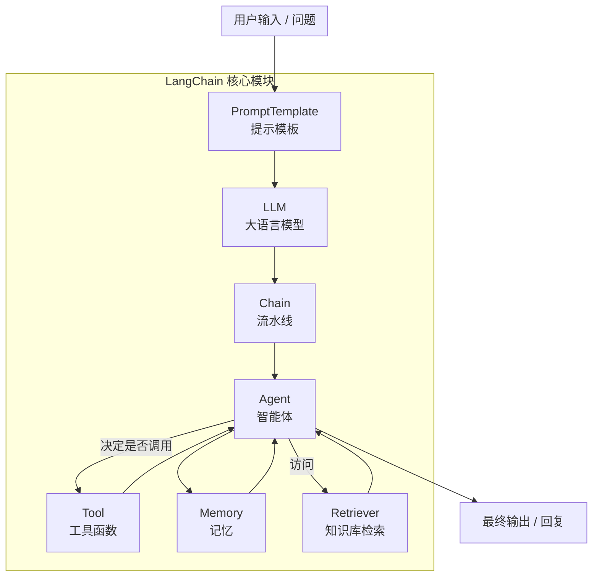
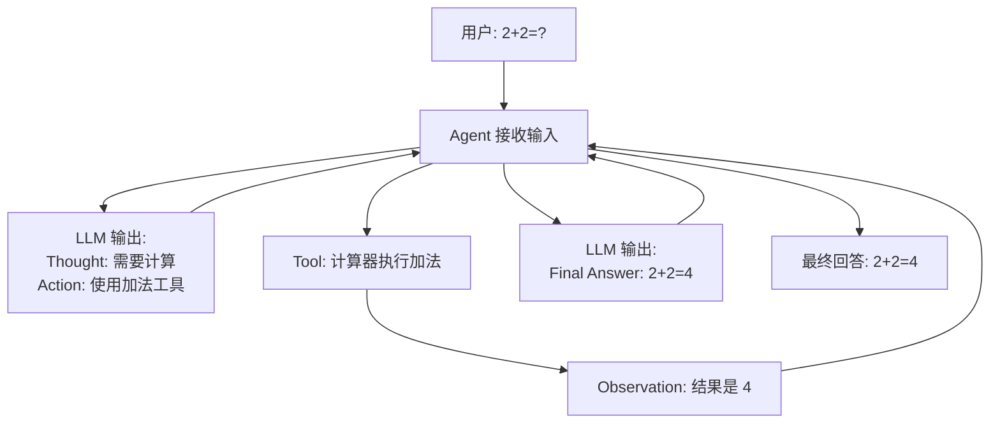
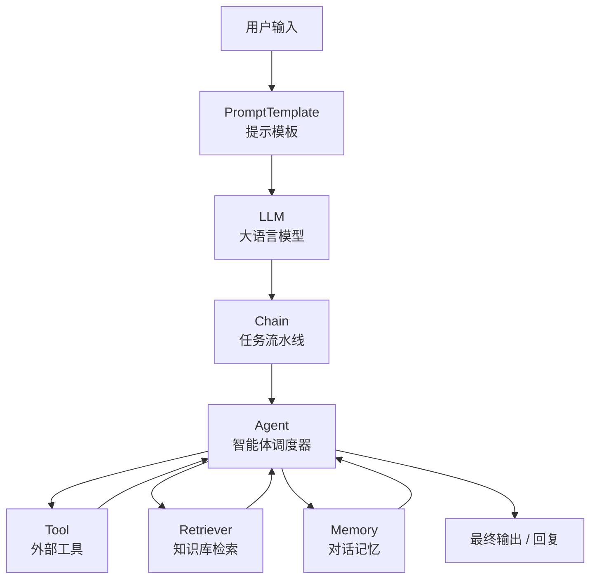
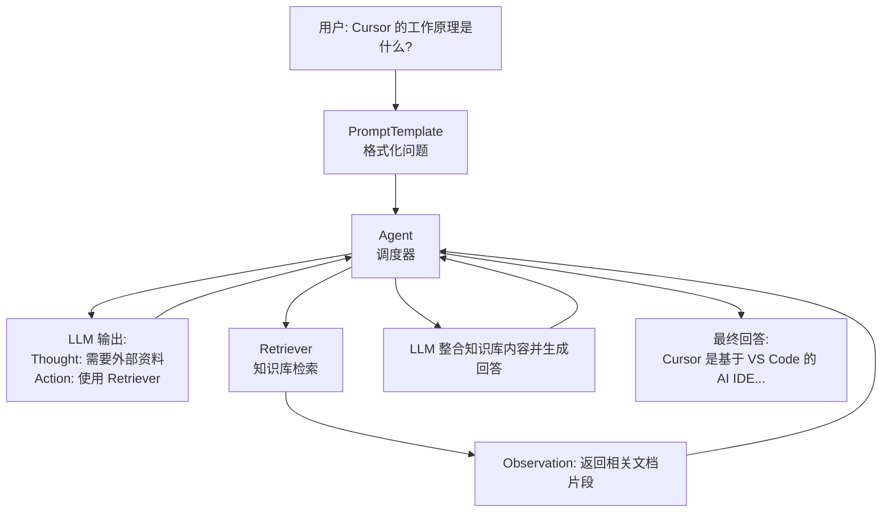
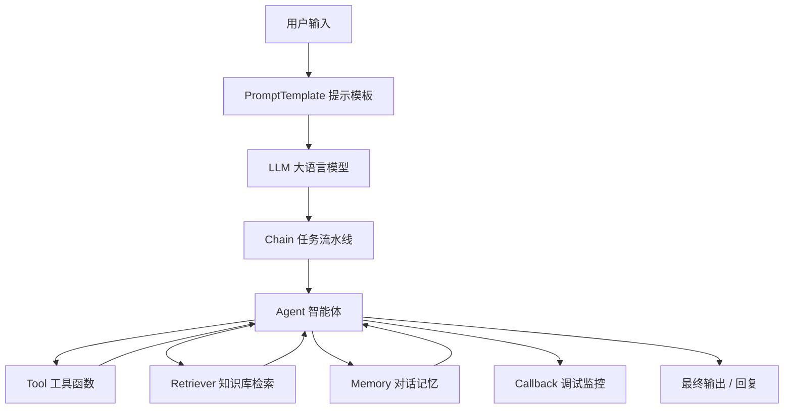

```mermaid
flowchart TD
    subgraph User[用户输入 / 问题]
    end

    subgraph LangChain[LangChain 核心模块]
        Prompt[PromptTemplate<br>提示模板]
        LLM[LLM<br>大语言模型]
        Chain[Chain<br>流水线]
        Tool[Tool<br>工具函数]
        Agent[Agent<br>智能体]
        Memory[Memory<br>记忆]
        Retriever[Retriever<br>知识库检索]
    end

    User --> Prompt --> LLM
    LLM --> Chain
    Chain --> Agent
    Agent -->|决定是否调用| Tool
    Agent -->|访问| Retriever
    Agent --> Memory
    Tool --> Agent
    Retriever --> Agent
    Memory --> Agent
    Agent --> Output[最终输出 / 回复]
```
---------------------------------------------------

```mermaid
flowchart TD
    User[用户: 2+2=?] --> Agent[Agent 接收输入]

    Agent --> LLM1[LLM 输出:<br>Thought: 需要计算<br>Action: 使用加法工具]
    LLM1 --> Agent

    Agent --> Tool[Tool: 计算器执行加法]
    Tool --> Obs[Observation: 结果是 4]
    Obs --> Agent

    Agent --> LLM2[LLM 输出:<br>Final Answer: 2+2=4]
    LLM2 --> Agent

    Agent --> Output[最终回答: 2+2=4]

```
------------------------------------------

```mermaid
flowchart TD
    User[用户输入] --> Prompt[PromptTemplate<br>提示模板]
    Prompt --> LLM[LLM<br>大语言模型]

    LLM --> Chain[Chain<br>任务流水线]

    Chain --> Agent[Agent<br>智能体调度器]

    Agent --> Tool[Tool<br>外部工具]
    Agent --> Retriever[Retriever<br>知识库检索]
    Agent --> Memory[Memory<br>对话记忆]

    Tool --> Agent
    Retriever --> Agent
    Memory --> Agent

    Agent --> Output[最终输出 / 回复]
```
-------------------------------------

```mermaid
flowchart TD
    User[用户: Cursor 的工作原理是什么?] --> Prompt[PromptTemplate<br>格式化问题]

    Prompt --> Agent[Agent<br>调度器]

    Agent --> LLM1[LLM 输出:<br>Thought: 需要外部资料<br>Action: 使用 Retriever]
    LLM1 --> Agent

    Agent --> Retriever[Retriever<br>知识库检索]
    Retriever --> Obs[Observation: 返回相关文档片段]
    Obs --> Agent

    Agent --> LLM2[LLM 整合知识库内容并生成回答]
    LLM2 --> Agent

    Agent --> Output[最终回答:<br>Cursor 是基于 VS Code 的 AI IDE...]
```
----------------------------

```mermaid
flowchart TD
    User[用户输入] --> Prompt[PromptTemplate 提示模板]
    Prompt --> LLM[LLM 大语言模型]

    LLM --> Chain[Chain 任务流水线]

    Chain --> Agent[Agent 智能体]

    Agent --> Tool[Tool 工具函数]
    Agent --> Retriever[Retriever 知识库检索]
    Agent --> Memory[Memory 对话记忆]

    Tool --> Agent
    Retriever --> Agent
    Memory --> Agent

    Agent --> Callback[Callback 调试监控]
    Agent --> Output[最终输出 / 回复]

```